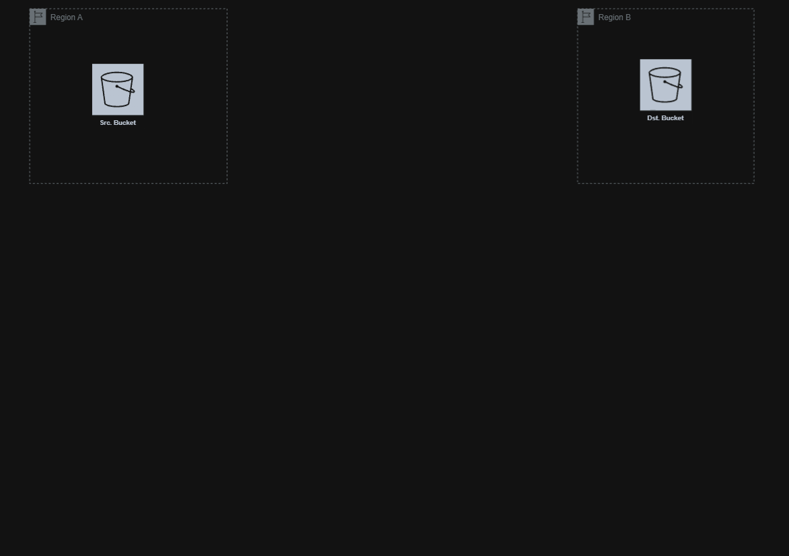

## Execution Steps

### S3

- paths /fresh , /resized, /watermarked , /final

1. create source ,destination buckets
2. enable versioning on both (required for CRR)
3. configure lifecycle handling to lower the cost for IA
4. create iam role with assume role for temp access from src bucket to dst bucket
5. create a policy for that assume role to interact with src and dst
6. create a resource policy for dst to allow replication interactions by source

### Lambda & step functions

1. create each single purpose lambda function
    -> Step Function lambdas
    1. Validate
    2. Resize
    3. Watermark
    4. Store
    5. formatter and send email

    -> helpers
    1. generatePresignedURL for s3 uploading
    2. function to trigger the sfn process by sqs message
    3. check status of image being processed

### SNS

1. create sns topic that uses email protocl to send notifications

### SQS

1. create main queue 
2. create dlq queue and select the main queue as src queue

### DynamoDB

1. create db table with primary key as only field defined since it's unstructured db so any other fields are handled by app itself

---

## Deployment & Usage Notes

### Note
1. the api-text.html must be live to be able to connect with resource, you may use VS code live server
2. Deploy using `terraform apply -var-file="secrets.tfvars"`, knowing the secrets.tfvars must have `smtp_password`, `smtp_user`
3. You can use Cloudfront when fetching images but i didn't, since it requires a verified AWS account
---

## References
- Terraform docs
- https://www.youtube.com/watch?v=1D9ggTJ9Ejc
- https://awstip.com/s3-cross-region-replication-and-s3-batch-operations-for-disaster-recovery-using-terraform-11a12fd2bc92
- https://oneuptime.com/blog/post/2026-02-23-create-lambda-with-api-gateway-integration-in-terraform/view
- https://oneuptime.com/blog/post/2026-02-23-how-to-create-eventbridge-pipes-with-terraform/view
- https://dev.to/aws-heroes/trigger-lambda-function-from-amazon-sqs-lets-build-series-5h1k
- https://oneuptime.com/blog/post/2026-02-23-create-lambda-layers-in-terraform/view
- https://aws.amazon.com/blogs/storage/managing-delete-marker-replication-in-amazon-s3/
- https://docs.aws.amazon.com/AmazonS3/latest/userguide/notification-content-structure.html
- https://medium.com/@IT_Sammy/amazon-sns-email-subscription-problems-26e385ced9f5 (due to that issue, i replaced with workflow from lamda -> sns -> mailbox with sns -> lambda -> mailbox)